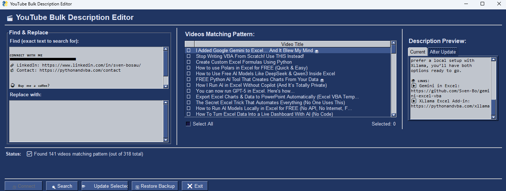

# YouTube Bulk Description Editor

A GUI tool to bulk find and replace text patterns in YouTube video descriptions across all your videos.



## Features

- 🔍 **Find & Replace** - Enter any text pattern to find and replace
- 📋 **Bulk Operations** - Update hundreds of videos at once
- 👁️ **Preview Changes** - See before/after comparison before applying
- ☑️ **Selective Updates** - Choose which videos to update
- 💾 **Auto Backup** - Automatic backup before each update
- 🔄 **Restore** - Rollback any video from backup if needed

## Getting Started

### 1. Set Up YouTube API

1. Go to [Google Cloud Console](https://console.cloud.google.com/)
2. Create a new project
3. Enable **YouTube Data API v3**
4. Create **OAuth 2.0 credentials** (Desktop App)
5. Download and rename to `client_secret.json`
6. Place in this folder

### 2. Install & Run

```bash
pip install -r requirements.txt
python youtube_description_editor_gui.py
```

### 3. Use the Tool

1. Click **Connect** (authenticates via browser)
2. Enter text to **Find** and **Replace with**
3. Click **Search** to find matching videos
4. Select videos and click **Update Selected**

## API Quota

YouTube API has a daily limit of 10,000 units. This tool is optimized to use minimal quota:
- Fetches 50 videos per API call
- ~5 calls for 200 videos

If you hit the limit, create a new Google Cloud project for fresh quota.

## Security

The `.gitignore` excludes sensitive files:
- `client_secret.json` - Your API credentials
- `token.pickle` - Your auth token
- `description_backups.json` - Your video backups
